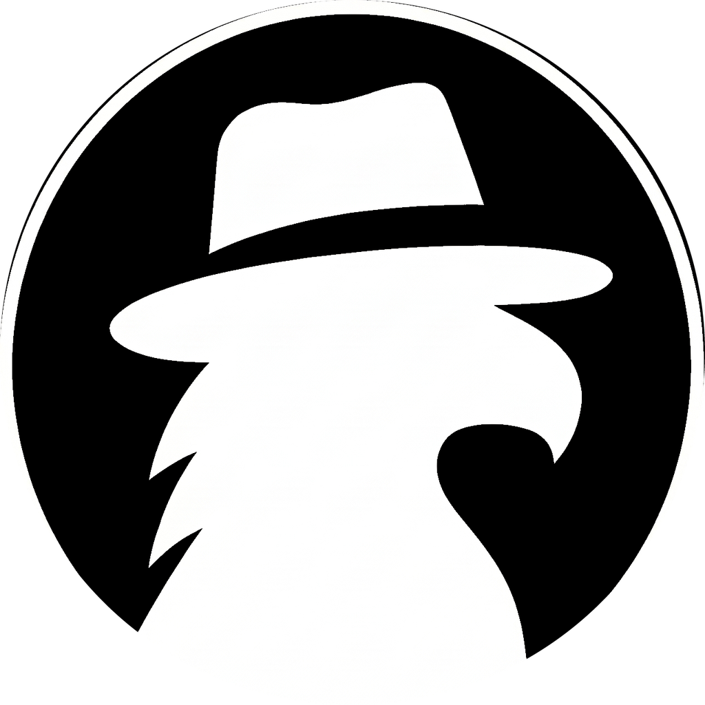

# Noxis

### Tu mascota de escritorio con voz, lista para ayudarte

 

 

 

[**Features**](#features) · [**Voice Commands**](#voice-commands) · [**Screenshots**](#screenshots) · [**Support**](#support-the-project)

---

<h1>Features</h1>

<table>
  <tr>
    <td width="50%" valign="top">

#### Conversación
- Háblale de forma natural, responde al instante
- Reconocimiento de voz **100 % offline** con Vosk (sin nube, con privacidad total)
- Reconocimiento tolerante a errores del micrófono (fuzzy match + variantes del nombre)
- Despiértala con su nombre y desactívala cuando no la necesites
- Conversación también por texto en un chat integrado

</td>
    <td width="50%" valign="top">

#### Control de tu PC
- Abre tus apps con solo decirlo: *"Noxis abre Discord"*
- Crea grupos ("packs") para lanzar varias apps a la vez con pausa configurable
- Acepta comandos hablados o escritos
- Lanza ejecutables de forma nativa

</td>
  </tr>
  <tr>
    <td width="50%" valign="top">

#### Personalización
- Cambia la apariencia de tu mascota (skins)
- Nombre personalizable (wake word a tu gusto)
- Tema claro y oscuro
- Doble modelo de voz: Estándar (40 MB) o Preciso (1.5 GB), con descarga integrada

</td>
    <td width="50%" valign="top">

#### Siempre a tu lado
- Mascota flotante arrastrable, sin bordes y transparente
- Inicia con tu sistema operativo
- Vive en la bandeja del sistema sin estorbar
- Multiplataforma (Windows, macOS y Linux)
- Interacciones naturales: clic, doble clic, clic derecho

</td>
  </tr>
</table>

---

<h1>Voice Commands</h1>

<h3>Habla de forma natural. Algunos ejemplos de lo que puedes decir:</h3>

<table>
  <tr>
    <td width="50%" valign="top">

- **"Noxis"** — la despiertas
- **"Noxis abre Discord"** — abre una app
- **"Noxis abre trabajo"** — lanza un grupo de apps
- **"Noxis desactívate"** — la duermes 💤

</td>
    <td width="50%" valign="top">

- **"Hola"**, **"¿Cómo estás?"** — conversación
- **"Gracias"**, **"Adiós"** — responde
- **"¿Quién eres?"**, **"Ayuda"** — para saber qué hace

</td>
  </tr>
</table>

<h4>La privacidad primero: cuando duerme, no muestra en pantalla lo que capta el micrófono; solo reacciona al escuchar su nombre para despertar.</h4>

---

<h1>Screenshots</h1>

 
 

> Las capturas se añadirán con las próximas actualizaciones. Mientras tanto, ¡pruébala tú mismo!

 
 

---

<h1>Support the Project</h1>

<h3>Noxis es libre y open-source. Si te saca una sonrisa o te facilita el día, considera apoyar su desarrollo 💛</h3>

---

<h1>Special Thanks</h1>

<h3>Noxis se apoya en un gran trabajo open-source.</h3>

<table>
  <thead>
    <tr>
      <th align="center">Project</th>
      <th align="center">Contribution</th>
    </tr>
  </thead>
  <tbody>
    <tr>
      <td align="center"><a href="https://electronjs.org"><strong>Electron</strong></a></td>
      <td>Multiplataforma para Windows, macOS y Linux</td>
    </tr>
    <tr>
      <td align="center"><a href="https://alphacephei.com/vosk"><strong>Vosk</strong></a></td>
      <td>Reconocimiento de voz offline</td>
    </tr>
  </tbody>
</table>

<h3>Gracias también a toda la comunidad open-source, por cada librería, herramienta y API que hace posible este proyecto.</h3>

---

<h1>Contributors</h1>

<h3>Este proyecto existe gracias a quienes creen en él.</h3>

---

<h1>Disclaimer</h1>

Este proyecto es **software libre** bajo la licencia **GPL-3.0**. Toda marca, servicio o propiedad intelectual referenciada pertenece a sus respectivos dueños.

---

Hecho con 💚 por <a href="https://github.com/Norvyz">Norvyz</a>

